# 👋 Hi, I'm Rajat Sahani

### Full-Stack Developer | MERN | Java | Python | AI/ML Enthusiast

I'm a Computer Science Engineering student and **Full-Stack Developer** passionate about building real-world web applications and exploring the possibilities of **Artificial Intelligence and Machine Learning**.

I enjoy turning ideas into practical products, building scalable web systems, and experimenting with **AI/ML technologies** to create smarter and more impactful applications.

I'm particularly interested in the intersection of **Full-Stack Development and AI**, where intelligent models can be integrated into real-world software products.

---

## 🚀 About Me

- 🎓 B.Tech Computer Science Engineering Student
- 💻 Full-Stack Developer focused on the **MERN Stack**
- ☕ Learning **Java & DSA**
- 🤖 Exploring **AI/ML & Generative AI**
- ☁️ Learning **AWS, Docker & CI/CD**
- 🧩 Interested in **System Design & Scalable Applications**
- 🚀 Building real-world projects and hackathon solutions

---

## 🛠️ Tech Stack

<table>
<tr>
<td align="center" width="50%">

### 💻 Languages

</td>

<td align="center" width="50%">

### ⚛️ Frontend

</td>
</tr>

<tr>
<td align="center" width="50%">

### 📱 Mobile

 

<b>React Native</b>

</td>

<td align="center" width="50%">

### 🧩 Backend

  

</td>
</tr>

<tr>
<td align="center" width="50%">

### 🗄️ Database

</td>

<td align="center" width="50%">

### 🤖 AI / Data

  

</td>
</tr>

<tr>
<td align="center" width="50%">

### ☁️ Cloud & DevOps

  

</td>

<td align="center" width="50%">

### 🔧 Tools & Design

</td>
</tr>

</table>

---

## 🚀 Featured Projects

### 🛒 E-Commerce Platform

A full-stack MERN e-commerce application with authentication, products, cart, orders, addresses and admin functionality.

**Tech:** React • Node.js • Express • MongoDB • JWT • Cloudinary

🔗 [Repository](https://github.com/rajatsahani272-bot/E-Commerce-Website)

---

### 🏙️ FixMyCity

An AI-powered civic complaint platform that helps citizens submit complaints and assists administrators with complaint analysis, categorization and priority detection.

**Tech:** React • Node.js • Express • MongoDB • Cloudinary • AI

---

### 🎓 Certify

A certificate management platform designed for hackathons and events.

Features include hackathon management, teams, participants, certificate templates, winners and automated certificate generation.

**Tech:** React • Node.js • Express • MongoDB • Cloudinary

---

## 🤖 AI / ML Exploration

I'm currently exploring **Artificial Intelligence and Machine Learning**, with an interest in applying AI to practical software products.

### 🔬 Current Focus

- 🐍 Python for AI/ML
- 📊 Data preprocessing
- 🔢 NumPy & Pandas
- 📈 Data visualization
- 🤖 Machine Learning fundamentals
- 🧠 Model training
- 📏 Model evaluation
- 💬 Natural Language Processing
- ⚡ AI APIs
- 🌐 AI integration with web applications

---

## 📚 Currently Learning

- ☕ Java & DSA
- ⚙️ Backend Engineering
- 🧩 System Design
- 🤖 AI / Machine Learning
- ☁️ Cloud & DevOps

---

## 🎯 Goals

- 🚀 Build production-ready full-stack applications
- ☕ Strengthen Java & DSA
- 🤖 Build practical AI/ML projects
- ☁️ Improve AWS & Docker skills
- 🧩 Learn scalable system design
- 💼 Prepare for software engineering opportunities

---

## 📊 GitHub Stats

---

## 🏆 GitHub Trophies

---

## 🐍 Contribution Graph

<picture>
  <source media="(prefers-color-scheme: dark)" srcset="./profile/github-snake-dark.svg">
  <source media="(prefers-color-scheme: light)" srcset="./profile/github-snake.svg">
  
</picture>

---

## 🌐 Connect With Me

---

## 👀 Profile Views

---

### 💡 Build. Learn. Improve. Repeat.

